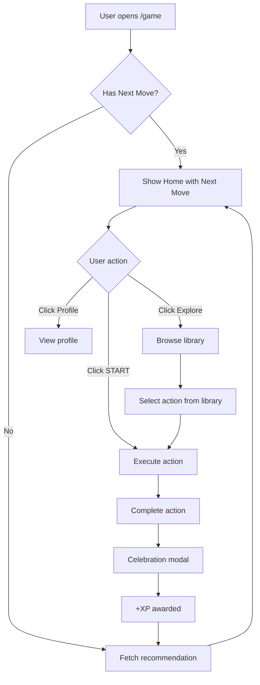

# Daily Loop Product Spec

> **Module:** Daily Loop (Game Home)
> **Master Result:** `Overwhelmed by options` → `Clear on my next move`
> **Priority:** Critical — this is the core engagement loop
> **Estimated Time:** 2-3 days

---

## 1. Master Result

| Point A | Point B |
|---------|---------|
| User opens app, doesn't know what to do | User sees ONE clear action, feels clarity |
| Life feels scattered, progress invisible | Progress is visible, momentum feels real |
| Overwhelm from too many growth paths | Calm confidence from guided simplicity |

**One-sentence Master Result:**
> Transform a confused returnee into a confident action-taker with one clear, personalized next move.

---

## 2. Sub-Results

| # | Sub-Result | Description | Screen(s) |
|---|------------|-------------|-----------|
| 1 | **See myself** | User sees their identity reflected back | ME section |
| 2 | **See my life** | User sees where they are across domains | MY LIFE section |
| 3 | **Know my next move** | User receives ONE recommended action | MY NEXT MOVE card |
| 4 | **Take action** | User executes the recommended action | Action screen |
| 5 | **Feel progress** | User sees XP gained, celebration | Completion celebration |
| 6 | **Explore freely** | User can browse library if they want | Explore drawer/page |

---

## 3. Screens

### 3.1 Home Screen (`/game`)

**Purpose:** Show player's identity, life status, and ONE next move.

```
┌─────────────────────────────────────────┐
│  [Header: Level + XP bar]               │
├─────────────────────────────────────────┤
│                                         │
│              ME                         │
│   Archetype icon + title               │
│   "The Visionary Architect"             │
│   XP: 1,250 · Level 4                   │
│   [View Profile →]                      │
│                                         │
├─────────────────────────────────────────┤
│                                         │
│            MY LIFE                      │
│   [8-domain radar or grid]              │
│   "Focus: Wealth (3/10), Health (4/10)" │
│   [See Details →]                       │
│                                         │
├─────────────────────────────────────────┤
│                                         │
│         MY NEXT MOVE                    │
│   ┌─────────────────────────────────┐   │
│   │ 🎯 Draft Your Offer Headline    │   │
│   │ Genius Path · 10 min · +15 XP   │   │
│   │                                 │   │
│   │ [START]                         │   │
│   └─────────────────────────────────┘   │
│                                         │
│   "Not this? Explore more →"            │
│                                         │
└─────────────────────────────────────────┘
```

#### Three Dan Tians:

| Dan Tian | Experience |
|----------|------------|
| 🫀 Heart | "I feel seen. This is ME. I know where I'm at." |
| 🧠 Mind | "I understand what to do next and why." |
| 🔥 Gut | **START** → execute the next move |

---

### 3.2 Action Execution Screen

**Purpose:** Guide user through the specific action.

This is handled by existing module screens:
- Practice screen (from Library)
- Upgrade step screen (from Skill Trees)
- External link (opens in-app browser)

#### Completion Flow:
```
User clicks START
     ↓
Navigate to action screen
     ↓
User completes action
     ↓
Mark complete button
     ↓
Return to Home with celebration
```

---

### 3.3 Completion Celebration Modal

**Purpose:** Reinforce progress, award XP, show new next move.

```
┌─────────────────────────────────────────┐
│                                         │
│              ✨                         │
│                                         │
│         Well done!                      │
│                                         │
│    +15 XP → Genius Path                 │
│    [Progress bar fills]                 │
│                                         │
│    ───────────────────                  │
│    Your next move is ready              │
│                                         │
│         [CONTINUE]                      │
│                                         │
└─────────────────────────────────────────┘
```

#### Three Dan Tians:

| Dan Tian | Experience |
|----------|------------|
| 🫀 Heart | "I did it! I'm growing." |
| 🧠 Mind | "I earned XP, I'm progressing." |
| 🔥 Gut | **CONTINUE** → see my new next move |

---

### 3.4 Explore Browser (`/game/explore`)

**Purpose:** Let user freely browse all available actions.

```
┌─────────────────────────────────────────┐
│  [← Back]         Explore               │
├─────────────────────────────────────────┤
│                                         │
│  [Filters: Vector | Duration | Type]    │
│                                         │
│  ┌─────────────────────────────────┐    │
│  │ 🧘 Morning Breath Practice      │    │
│  │ Spirit · 10 min · +10 XP        │    │
│  └─────────────────────────────────┘    │
│                                         │
│  ┌─────────────────────────────────┐    │
│  │ 📝 Draft Your Origin Story      │    │
│  │ Genius · 15 min · +20 XP        │    │
│  └─────────────────────────────────┘    │
│                                         │
│  ┌─────────────────────────────────┐    │
│  │ 💬 Reach Out to a Friend        │    │
│  │ Emotions · 5 min · +5 XP        │    │
│  └─────────────────────────────────┘    │
│                                         │
└─────────────────────────────────────────┘
```

---

### 3.5 Empty States (Critical)

**Purpose:** Handle users who are missing required data.

#### No Zone of Genius (ME section)

```
┌─────────────────────────────────────────┐
│              ME                         │
│   🌟                                    │
│   "Let's discover who you are"          │
│   [Discover My Genius →]                │
└─────────────────────────────────────────┘
```

#### No Quality of Life Data (MY LIFE section)

```
┌─────────────────────────────────────────┐
│            MY LIFE                      │
│   📊                                    │
│   "See where you are across 8 areas"    │
│   [Map My Life →]                       │
└─────────────────────────────────────────┘
```

#### No Next Move Available

```
┌─────────────────────────────────────────┐
│         MY NEXT MOVE                    │
│   ✨                                    │
│   "You've completed all recommended     │
│    actions! Explore for more."          │
│   [Explore →]                           │
└─────────────────────────────────────────┘
```

---

### 3.6 Action Routing

**Purpose:** Define where each action type navigates.

| Action Type | Target Route | Return Param |
|-------------|--------------|--------------|
| Upgrade Step | `/game/skill-trees/{vector}?step={id}` | `?return=/game` |
| Practice | `/game/library/practice/{id}` | `?return=/game` |
| External Link | In-app browser OR new tab | Completion = manual |
| Life Action | Modal with checkbox | Inline completion |
| Profile Step | `/game/profile?section={name}` | `?return=/game` |

**Completion Detection:**
- In-app actions: Button press "Mark Complete"
- External links: Return to app triggers "Did you complete this?" prompt
- Life actions: User checks off manually

---

## 4. User Flow Diagram



---

## 5. Recommendation Algorithm (v1)

```typescript
function getNextMove(profile: GameProfile): Action {
  // 1. Get lowest QoL domain
  const lowestDomain = findLowestQolDomain(profile.qol_scores);
  
  // 2. Map domain to growth vector
  const vector = mapDomainToVector(lowestDomain);
  
  // 3. Get next unlocked action in that vector's sequence
  const completedActions = await getCompletedActions(profile.id);
  const nextAction = findNextInSequence(vector, completedActions);
  
  return nextAction;
}
```

### Domain → Vector Mapping:

| QoL Domain | Primary Vector |
|------------|----------------|
| Wealth | Genius |
| Health | Body |
| Happiness | Spirit |
| Love | Emotions |
| Impact | Mind |
| Growth | Spirit *(tie-breaker: Spirit wins)* |
| Social | Emotions |
| Home | Body |

**Tie-breaker Rule:** When a domain maps to multiple vectors, use the first listed.

### Starter Actions (v1):

If user has no completed actions, start with these:

| Vector | First Action |
|--------|--------------|
| Genius | "Articulate Your Top 3 Talents" |
| Body | "10-min Morning Stretch" |
| Spirit | "5-min Breathing Practice" |
| Emotions | "Gratitude Journal Entry" |
| Mind | "Read 1 Educational Article" |

---

## 6. Data Requirements

### Terminology Glossary

> **Clarification to prevent confusion:**

| Term | Definition |
|------|------------|
| **Action** | Any completable activity (umbrella term) |
| **Upgrade** | Skill tree step that unlocks capabilities |
| **Practice** | Repeatable transformational activity (breathwork, journaling) |
| **Life Action** | Real-world task (have a conversation, apply for job) |
| **Microlearning** | Short educational content (video, article) |

**Key insight:** `upgrade_catalog` contains upgrades. We'll reuse this for v1. 
Practices and other actions can be added later to a separate catalog.

### Existing Tables Used:
- `game_profiles` (player state, XP, level)
- `qol_snapshots` (domain scores)
- `upgrade_catalog` (available upgrades — our v1 action source)
- `active_upgrades` (completed/in-progress)

### New Data Needed (v1):
- None — reuse existing tables for MVP
- v2: `action_catalog` for practices, microlearning, life actions

---

## 7. Extension Points

### Artifacts Produced:
- Action completion records
- XP history

### Emotional States:
| Moment | Emotion |
|--------|---------|
| See Home | Calm clarity |
| See Next Move | Confident direction |
| Complete Action | Accomplishment |
| Celebrate | Pride, momentum |

### Skip Paths:
- User can explore instead of following recommendation
- User can view profile instead of taking action
- No pressure, no guilt

### Bridges to Other Modules:
- **Profile** — Quick access from ME section
- **QoL Map** — Quick access from MY LIFE section  
- **Library** — Browse all available actions
- **Skill Trees** — Deep dive into any vector

---

## 8. What We Already Have

From reviewing current codebase:
- `GameHome.tsx` — exists, has some of this structure
- XP system — implemented
- Progress bars — implemented
- Upgrade catalog — exists

### Gap Analysis:

| Component | Status |
|-----------|--------|
| ME section | Partial (profile exists) |
| MY LIFE section | Partial (QoL data exists) |
| MY NEXT MOVE card | Needs work (v1 has Main Quest card) |
| Recommendation algorithm | Needs work |
| Completion celebration | Needs work |
| Explore library | Partial (Library page exists) |

---

## 9. Success Metrics

| Metric | Target |
|--------|--------|
| Daily return rate | 30%+ users return next day |
| Action completion rate | 50%+ of displayed actions completed |
| Session length | 5-15 minutes |
| User sentiment | "I know what to do" |

---

## 10. Risks & Mitigations

| Risk | Mitigation |
|------|------------|
| Recommendation feels arbitrary | Show WHY (domain-based) |
| User has no progress data | Show "Getting to know you" state |
| Action library is empty | Pre-populate with core practices |
| User always skips recommendation | That's fine — explore is valid |

---

*Daily Loop Product Spec v1.0*
*Created: 2026-01-27*
