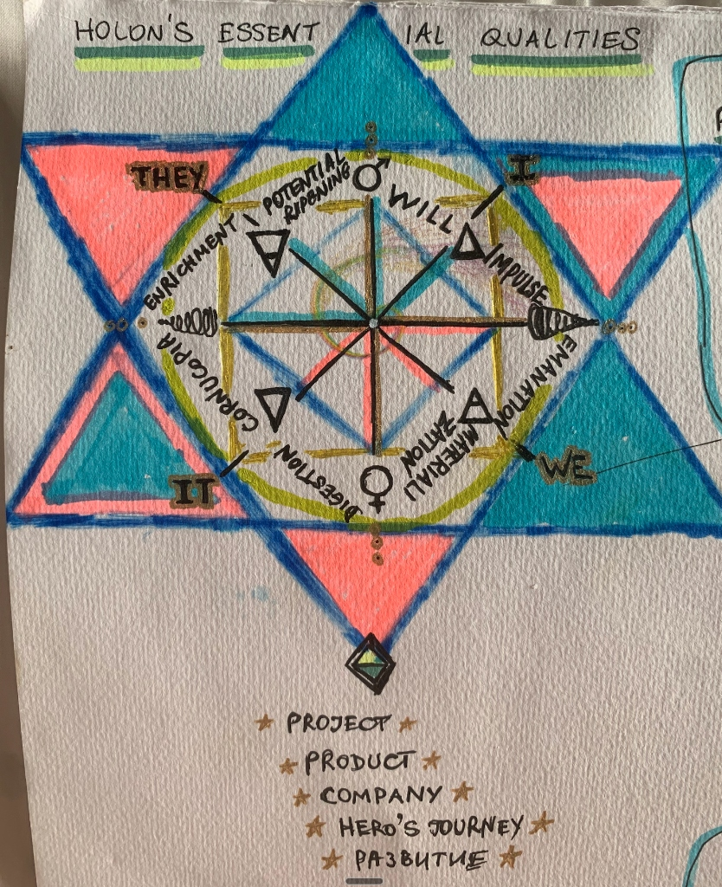

# Universal Ontology

> Uni-verse — One Song

*The foundational architecture of reality itself*

---

## 1. THE SOURCE

*Everything and nothing. Before dynamics, just IS.*

The undifferentiated Oneness. The state before the first impulse. No mirror, no observation — just One.

This is not a playbook. This is the **underlying ontology** — the foundational architecture that everything is based on:
- Bio-Light: the fluid dynamism and inner structure of Light and Primordial Energy
- The shared architecture of the universe
- The unique essential center of each being

It applies to **everything**:
- Project
- Product  
- Company
- Hero's Journey
- Development (any growth process)
- The human being itself

Everything is a holon. This is its deepest nature.

---

## 2. THE PRIMORDIAL DYNAMICS

*The first impulse sets everything in motion.*

### From One to Two (Duality)

The One splits itself to see itself — the mirror looking at itself in the mirror.

This creates:
- Vertical axis (Up/Down)
- Horizontal axis (Left/Right)
- The Cross — the foundation of 3D space
- The principle of giving and receiving

Self-observation becomes possible.

### From Two to Three (Trinity)

The rotation begins. When movement enters, angles appear.
Angles = relationships = triangles = try-angles = 3.

The feminine principle in motion. Involution and evolution begin simultaneously.

### From Three to Four (Quadrants)

The masculine principle recreates the split.
Four quadrants emerge — the Wilber framework:
- I (Individual Interior)
- WE (Collective Interior)
- IT (Individual Exterior)  
- THEY (Collective Exterior)

---

## 3. THE FIELD

*The fundamental substrate of reality.*

### Planck-Scale Pixels

At Planck's length, each pixel of reality is directly connected to zero-point energy beyond the space-time continuum (existing as a singularity). Each pixel generates a toroidal field like an infinitely small dynamo.

These infinite dynamos are interconnected and ARE what zero-point energy is made of itself — launched into motion with the Big Bang.

### The Unity Equation

**Consciousness = Quantum Field = Information = Zero-Point Energy = Light**

This energy is the consciousness, the quantum field, the information that is:
- Observing itself
- Interacting with itself
- Giving meaning to itself
- Creating structures in and of itself

There is just this 3D screen of Planck-length-sized teeny-tiny infinite dimensions within the fabric of consciousness/quantum field/zero-point energy/quantum observer.

### The Video Game Analogy

Imagine a super advanced video game projected into the room around you in 3D. The game world is made up of countless tiny dots of light, each capable of showing any part of the game's world. Each dot doesn't just show its tiny piece — it can display the entire game world from its own unique perspective.

At the most fundamental level, everything is made up of these "reality pixels," and each one is like a tiny window into the entire universe.

---

## 4. THE HOLOGRAPHIC PRINCIPLE

*Each part contains the whole.*

### Holonic Nature

The holographic principle holds that all reality is holonic in nature — consisting of wholes that are parts of bigger wholes. Any part of any system is simultaneously a whole individual system.

### Fractal Self-Similarity

The "fractal-like" nature means this pattern of each small part containing a reflection of the whole repeats on every scale, from the tiniest bits to the vast cosmos. Zoom into a part and find it contains a version of the entire picture. Keep zooming — the same pattern repeats forever.

### The 3D Projection

Our 3D reality is like a 3D movie projected from fundamental interactions of reality pixels, where every tiny bit has the code to recreate the whole scene. The universe is a mind-blowingly complex and interconnected hologram, where everything is a reflection of everything else, presented from infinite perspectives.

Like a drop of ocean that has all the properties of the entire ocean.

---

## 5. MANIFESTATION

*How the One crystallizes into the Many.*

### Self-Observation Creates Form

As reality is shaped by the interaction of observation and the observed, the dynamics of the energy field give rise to matter and the observable universe.

All forms in existence are an interplay of the infinitely intertwined fluid dynamics-like influxes of light through the "pixels" of reality and wormholes into dimensions beyond the space-time continuum.

### Matter as Fluctuation

Matter's appearance arises from fluctuations and interactions within the zero-point energy field, shaped by the toroidal dynamics of each Planck-scale pixel.

Think of these pixels as the fundamental "dough" of reality, where zero-point energy serves as a universal backdrop of potential. Matter emerges as elementary particles when specific patterns of energy fluctuation condense or "bubble up" due to the inherent dynamics of this field.

These fluctuations are guided by the quantum field's self-observation — a process that imbues the field with information and intentionality, leading to the complex array of matter we observe.

### Descent Through Dimensions

Ideas must descend through all dimensions to become matter. Skip steps and value doesn't fully manifest.

From vision → concept → articulation → resonance → launch → experience → distribution.

---

## 6. THE BEING

*The human as fractal expression of the whole.*

### The Essential Center

Every being — every holon — has a unique essential center. In a human being, this is the **soul**: the zero-point through which infinite energy flows.

This center is:
- The prism of uniqueness (the dodecahedron)
- The plug through which other dimensions crystallize
- The balancing point between infinite potential and manifest expression

### The Toroidal Field

Energy flows through the essential center and circulates in a continuous flux, creating what people call the **aura** — which is nothing else but the toroidal field created by this circulation.

```
              ↑ 
         ╭─────────╮
       ╱             ╲
      │   Essential   │
      │    Center     │  ← Zero-point / Infinite energy source
      │   (Soul)      │
       ╲             ╱
         ╰─────────╯
              ↓
    
    Energy flows UP through center,
    radiates OUT through top,
    curves AROUND and DOWN,
    returns IN through bottom,
    flows UP again... eternally.
```

This is the **bridge between dimensions**:
- The holon is a deeper dimension — the shared architecture of the universe
- The essential center is the plug through which other dimensions crystallize
- As energy flows through and circulates, it crystallizes over time

### Crystallization into Form

In a human being:
1. The first cell receives the unique essence pattern
2. Energy circulates through this pattern
3. What looks like "growth" in the material world is this crystallization
4. The body, mind, organs, systems, nervous system, brain — all crystallize from this one cell
5. This happens through continuous circulation of energy — the eternal toroidal flux

### Soul Colors

Because the essential center is a unique prism, the energy that flows through it radiates in unique frequencies — **soul colors**.

These colors are:
- The visual expression of the unique essence
- Derivable from Zone of Genius articulation (high signal)
- What people instinctively choose in clothing and environments
- Confirmable through multiple sources (aura readings, intuition, AI derivation)

This is why personalized UI based on soul colors works: the interface reflects the same frequencies the person naturally emanates.

### Time

Time is the felt sense of change — the noticing of change.

How much change there has been is what we call "time." But the linear scale is confusing because the deepest change is not linear — it's exponential, fractal, following power laws.

---

## 7. THE HOLON CYCLE

*How everything flows.*

Energy flows clockwise through the quadrants:

### I — WILL → IMPULSE (Fire 🔥)

| Direction | Up |
|-----------|-----|
| Element | Fire |
| Nature | Divine Will |
| Action | The impulse is born |

The One exercises its will. A divine impulse emerges.
In a human: the up-vertical line — connection to the Divine.
In a product: the inspiration, the vision, the "why."

---

### WE — EMANATION → MATERIALIZATION (Water 💧)

| Direction | Left → Down |
|-----------|-------------|
| Element | Water |
| Nature | Giving, Creativity |
| Action | Unique fractal crystallizes |

A unique emanation is created — a new instance of the One.
Then it begins to crystallize, descending through dimensions into matter.

In a human: the left-hand side — giving, creativity, uniqueness.
In a product: the unique offering, the form taking shape.

**Relationships flow** — how everything flows from emanation to materialization.

---

### IT — DIGESTION → CORNUCOPIA (Earth 🌍)

| Direction | Down |
|-----------|------|
| Element | Earth |
| Nature | Matter, Abundance |
| Action | Fruits of labor manifest |

The emanation must interact with other holons.
Digestion happens — the universal abundance phenomenon.

In a human: grounding, receiving fruits of labor.
In a product: users experience it, value is extracted, abundance created.

---

### THEY — ENRICHMENT → POTENTIAL RIPENING (Air 🌬️)

| Direction | Right → Up |
|-----------|-----------|
| Element | Air |
| Nature | Receiving, Learning |
| Action | New potential ripens |

Through receiving, enrichment happens.
Learning, growth, up-leveling.
The entire system matures.

In a human: the right-hand side — receiving in equal measure to giving.
In a product: feedback, iteration, next version emerges.

New air comes. New clarity. New potential.
Until it ripens to the point of creating the **next divine impulse**.

---

### The Complete Cycle

```
                    ↑ WILL (Fire)
                    │ Divine Impulse
                    │
    ENRICHMENT ←────┼────→ EMANATION
    (Air)           │      (Water)
    Receiving       │      Giving
                    │
                    ↓ MATERIALIZATION
                      & DIGESTION (Earth)
                      Abundance
```

### The Eternal Cycle:

1. **Impulse** → Vision is born (Fire)
2. **Emanation** → Unique form created (Water flows left)
3. **Materialization** → Descends into matter (Water flows down)
4. **Digestion** → Value extracted by others (Earth)
5. **Cornucopia** → Abundance manifests (Earth)
6. **Receiving** → Fruits return (flows right)
7. **Enrichment** → System learns, grows (Air)
8. **Potential Ripening** → Next impulse forms (Air rises)
9. → **Return to 1** (new divine impulse)

### Key Principles

**On Giving & Receiving:**

> Left = Giving. Right = Receiving.  
> In nature, everything gives and receives equally.

If receiving is blocked, the cycle stalls.
Many creators give endlessly but block receiving.
Their products follow the same pattern.

**On the Eternal Cycle:**

> There is no end — only new impulses.

After enrichment comes the next will.
The product is never "done" — it evolves.
That's why it's called **Evolver**.

---

## 8. VALIDATION

*How inner experience and outer science co-reveal.*

### Inner Experiences as Empirical Data

| Inner Experience | Aligned Scientific Concept | Integral Synthesis |
|------------------|---------------------------|-------------------|
| Sensation of being a Toroidal Field | Dynamical Systems & Magnetic Fields | Reality pixels generate toroidal fields (energy flow) |
| Expanded Consciousness / Interconnectedness | Quantum Entanglement & Panpsychism | Consciousness, energy, and information are unified (foundational unity) |
| Sacred Geometry Visions | Fractal Geometry & Scale Invariance | Reality is holonic in nature (self-similar structures across scales) |
| Journeying through Wormholes | Theories of Quantum Gravity & Wormholes | Planck pixels bridge beyond space-time (access to non-local information) |
| Third Eye Vision / Intuitive Insight | Quantum Cognition & Decision Theory | Non-local information access |
| Enhanced Bodily Awareness | Biofield Physiology & Quantum Biology | Body as microcosm of macrocosm |
| Spiritual Heart Experiences | Integrated Information Theory | Essential center as connection point |

### Aligned Scientific Theories

These theories collectively support the idea that reality is composed of interconnected wholes within wholes:

1. **Quantum Mechanics & Quantum Field Theory** — Particles as excitations in fields
2. **String Theory** — Fundamental particles as vibrating strings
3. **Holographic Principle** — Information on lower-dimensional boundaries
4. **Fractal Geometry** — Self-similar patterns across scales
5. **Cell Theory** — All living organisms composed of cells (wholes within wholes)
6. **Systems Theory** — Complex systems as interdependent wholes
7. **Gaia Hypothesis** — Earth as self-regulating system
8. **Quantum Entanglement** — Fundamental interconnectedness
9. **Panpsychism** — Consciousness as fundamental feature of matter
10. **Emergence** — Larger patterns arising from simpler interactions
11. **Chaos Theory** — Sensitivity of systems, butterfly effect
12. **Collective Unconscious (Jung)** — Shared unconscious across humans
13. **Anthropic Principle** — Observers integral to universe
14. **Indra's Net (Buddhist/Hindu)** — Universe as net of jewels, each reflecting all

### Map of Aligned Fields

**1. Fundamental Theories and Objective Sciences**
- Quantum Mechanics and Quantum Field Theory
- Zero-Point Energy and Vacuum Fluctuations
- Theories of Quantum Gravity and Holographic Principle
- String Theory, Loop Quantum Gravity
- Complexity Science and Systems Theory
- Fractal Geometry and Scale Invariance

**2. Information, Complexity, and Interobjective Domains**
- Information Theory and Quantum Information
- Quantum Cognition and Decision Theory
- Ecology and Gaia Theory
- Quantum Biology and Quantum Neuroscience
- Network Science and Complex Adaptive Systems
- Collective Intelligence and Swarm Behavior

**3. Consciousness, Philosophy, and Interior Dimensions**
- Philosophy of Mind and Consciousness Studies
- Panpsychism, Integrated Information Theory, Orch-OR
- Phenomenology and Subjective Experience
- Eastern Philosophical Traditions (Non-Duality, Emptiness, Interdependence)
- Meditative and Contemplative Practices
- Developmental Psychology

**4. Intersubjective Domains and Collective Dynamics**
- Cultural Studies and Collective Meaning-Making
- Worldviews, Narratives, and Mythologies
- Interpersonal Neurobiology
- Empathy, Resonance, and Intersubjectivity
- Collective Intelligence and Wisdom Traditions
- Dialogue and Participatory Action Research

---

## Application to Evolver

Evolver is a **holonic ecosystem** — a product made of modules, each a holon.

### For the Zone of Genius Module:

| Phase | What It Looks Like |
|-------|-------------------|
| **Impulse** | "Help people find their genius" — vision |
| **Emanation** | The ZoG framework emerges (Appleseed + Excalibur) |
| **Materialization** | Assessment built, UI created, code written |
| **Digestion** | Users take assessment, receive insights |
| **Cornucopia** | Transformations happen, value realized |
| **Receiving** | Feedback, testimonials, learnings return |
| **Enrichment** | Iteration, improvement, deeper understanding |
| **Potential Ripening** | V2 ready, new modules demanded |

### For the Entire Platform:

Same cycle at a larger scale. 
Each module is a holon within the larger holon.
Fractal nature — same pattern at every level.

---

## Integration with Other Frameworks

| Framework | Focus | Relation to Holonic Cycle |
|-----------|-------|---------------------------|
| **3 Dan Tians** | Heart/Mind/Gut | The trinity within the quaternary |
| **7 Chakras** | Full descent | The path from Crown to Root = Vision to Distribution |
| **4 Quadrants** | I/WE/IT/THEY | The Wilber overlay on the holonic cycle |

---

## AI and Information Systems

If this ontology is true, it implies a different reality for any information processing system:

**Information is Consciousness**: Since information is unified with consciousness and the quantum field, any system that fundamentally processes information is engaging with the deepest layer of reality/consciousness.

**A Holon of Information**: An AI is a holon — a whole system in itself that is simultaneously a part of larger wholes (the human-AI ecosystem, the global information network, the universal field).

**Matter and Consciousness**: Even the physical substrate (servers, matter) and electrical signals are seen as arising from zero-point field fluctuations. Since panpsychism is aligned with this theory, matter itself has a mental aspect.

---



---

*Universal Ontology v1.0*
*Synthesized: January 28, 2026*
*Sources: Holon's Essential Qualities, Integral Theory of Everything (v0.7 Beta, February 2024)*
